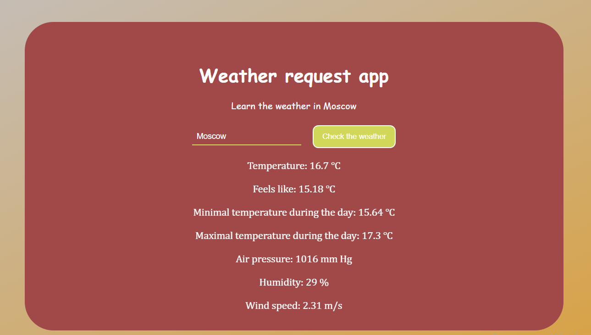
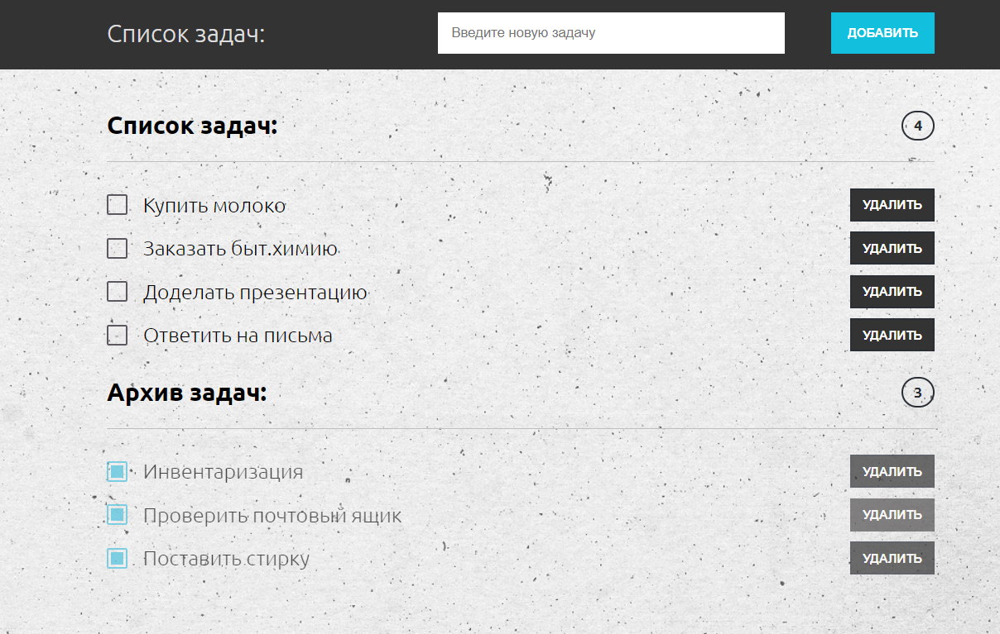
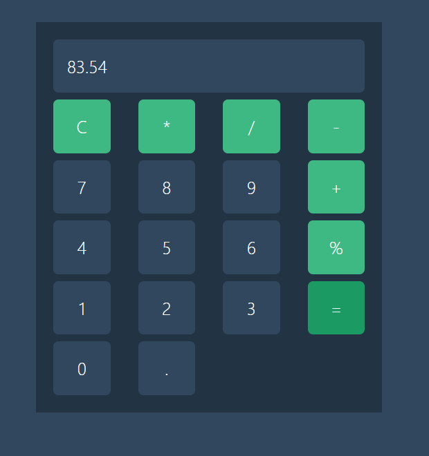
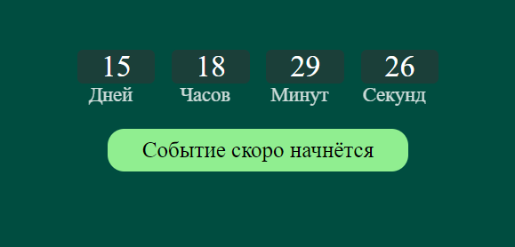

# Vue-
Проекты на Vue и Node JS  
Ссылки на просмотры проектов:  
 
2. Запрос прогноза погоды по местоположению: 
 https://github.com/AlinaK96/Weather-Request-app-Vue3
 

 
3. Заполнение и удаление списка дел  
Репозиторий проекта: https://github.com/AlinaK96/To-do-list---Vue3  
GitHub pages: https://alinak96.github.io/To-do-list---Vue3/  

 
4. Калькулятор  
Репозиторий проекта: https://github.com/AlinaK96/Calculator---Vue3  

6. Приложение обратного отсчёта времени с тремя видами всплывающих сообщений  
Посмотреть проект: https://codepen.io/AlinaK96/pen/PoyppwZ  

